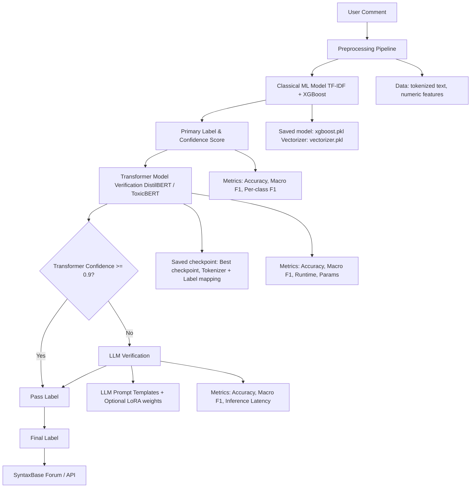
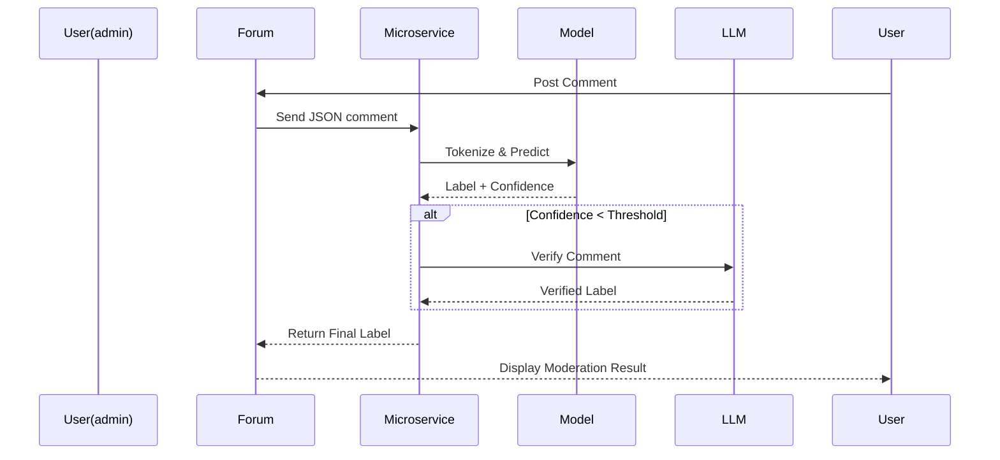

# System Architecture – Multi-Phase Toxicity Detection System

This document describes the architecture of the Multi-Phase Toxicity Detection System, detailing the model pipeline, integration with the SyntaxBase forum, and the hybrid moderation setup.

---

## 1. High-Level Overview

The system consists of three main layers:

1. **Classical ML Layer**
   - TF-IDF + numeric features
   - XGBoost / Logistic Regression
   - Fast and lightweight; serves as first-pass filter

2. **Transformer Layer**
   - Fine-tuned DistilBERT / ToxicBERT
   - Semantic and contextual understanding
   - Handles nuanced toxicity missed by classical models

3. **LLM Layer (Optional / Phase 3)**
   - Zero-shot or few-shot classification
   - Context-aware moderation and edge cases
   - Acts as a verification layer for uncertain predictions

---

## 2. Data Flow
### Overall Model Pipeline

---

## 3. Microservice Integration

- **API:** FastAPI backend wrapping DistilBERT/ToxicBERT
- **Endpoint:** `/classify`
- **Input:** JSON comment
- **Output:** JSON label (`safe`, `mild`, `toxic`, `severe`)
- **Hybrid Mode:** Optional LLM verification if transformer confidence < threshold
- **Deployment:** Docker or MCP service (planned for production-scale testing)

---

## 4. Artifact Storage

- **Models:** `models/saved/`
- **Metrics & Results:** `results/metrics`, `results/comparisons`
- **Training Logs:** `docs/training_logs.md`

---

## 5. Notes & Future Improvements

- Add real-time LLM fallback for edge cases
- Experiment with caching or batched inference for throughput
- Multi-lingual toxicity detection in future iterations