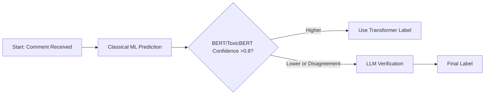
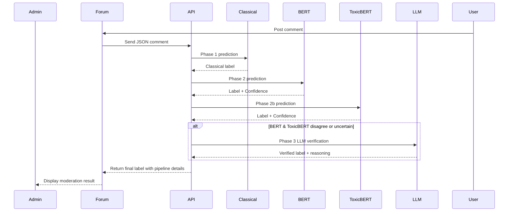
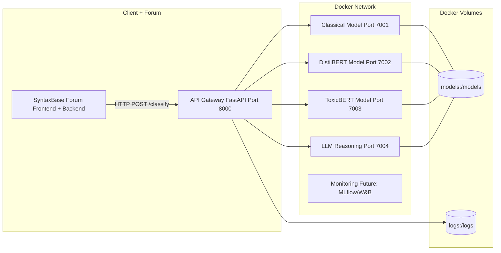
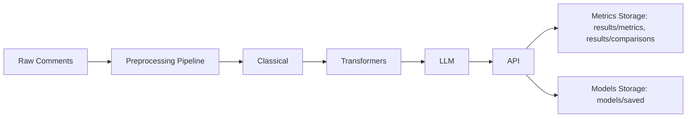

# System Architecture – Multi-Phase Toxicity Detection System

This document describes the architecture of the Multi-Phase Toxicity Detection System, detailing the model pipeline, integration with the SyntaxBase forum, and the hybrid moderation setup.

---

## 1. High-Level Overview

The system consists of three main layers:

1. **Classical ML Layer**
   - TF-IDF + numeric features
   - XGBoost / Logistic Regression
   - Fast and lightweight; serves as first-pass filter

2. **Transformer Layer**
   - Fine-tuned DistilBERT / ToxicBERT
   - Semantic and contextual understanding
   - Handles nuanced toxicity missed by classical models

3. **LLM Layer (Phase 3)**
   - Zero-shot or few-shot classification
   - Context-aware moderation and edge cases
   - Acts as a verification layer for uncertain predictions

---

## 2. Data Flow
### 2.1 Overall Model Pipeline

---
### 2.2 Decision flow

>**Note**: A disagreement between the transformer models occurs when DistilBERT and ToxicBERT produce different predicted labels, regardless of confidence score.

## 3. Microservice Integration

The SyntaxBase Moderation Microservice is fully containerized and modular. Each model/service runs in its own Docker container, orchestrated via Docker Compose. The API exposes a single endpoint for comment moderation, implementing a **hybrid multi-phase pipeline**:

1. **Classical ML:** Fast, rule-based moderation using numeric and TF-IDF features.
2. **Transformer Models:** DistilBERT and ToxicBERT provide semantic analysis with confidence scores.
3. **LLM Verification:** If BERT/ToxicBERT disagree or are uncertain, a preloaded LLM evaluates the comment for final moderation.

**API Service:**
- **Framework:** FastAPI
- **Endpoint:** `/classify`
- **Input:** JSON comment, e.g. `{"text": "Your comment here"}`
- **Output:** JSON with:
  - `final_label` (safe, mild, toxic, severe)
  - Intermediate labels and confidence from classical, BERT, and ToxicBERT
  - Optional `llm_reasoning` when LLM is invoked

### 3.1 Sequence Diagram

---

### 3.2 Deployment diagram

All services are Dockerized and networked together via Docker Compose.

Ports:
- `classical`: 7001
- `bert`: 7002
- `toxicbert`: 7003
- `llm`: 7004
- `api`: 8000

---

### 3.3 Metrics and artifact flow

>**Note:** This flowchart reflects the consolidated results, metrics, and comparative analyses obtained from the final evaluation phase.

---

## 4. Artifact Storage
- **Models:** `models/saved/`
- **Metrics & Results:** `results/metrics`, `results/comparisons`
- **Training Logs:** `docs/training_logs.md`
