# Introduction

This documentation provides a complete guide to the **SyntaxBase Moderation Microservice**, covering its architecture, deployment, model pipelines, and evaluation workflows.

It includes:

- System architecture and **multi-phase model design**  
- Microservice integration and **Docker deployment**  
- Data preprocessing, training, and evaluation workflows  
- Logging, artifact storage, and monitoring strategies  

## Documentation Overview

- [Architecture](architecture.md) – High-level system design, model pipeline, and microservice integration.
- [Research Paper](research_paper.md) – Full research-style write-up, including dataset, methodology, experiments, results and more.
- [Training Logs](training_log.md) – Chronological records of all training runs, checkpoints, and metrics.
- [Notebooks](../notebooks/) – Jupyter notebooks for baseline experiments, transformer evaluation, model comparison, error and metrics analysis.
- [Results](../results/) – Saved metrics, model comparisons, logs and visual evaluation artifacts
- [Models](../models/saved/) – Stored classical and transformer model checkpoints, tokenizers, and label mappings.

---

# System Architecture

This document describes the architecture of the Multi-Phase Toxicity Detection System, detailing the model pipeline, integration with the SyntaxBase forum, and the hybrid moderation setup.


## 1. High-Level Overview

The system consists of three main layers:

1. **Classical ML Layer**
   - TF-IDF + numeric features
   - XGBoost / Logistic Regression
   - Fast and lightweight; serves as first-pass filter

2. **Transformer Layer**
   - Fine-tuned DistilBERT / ToxicBERT
   - Semantic and contextual understanding
   - Handles nuanced toxicity missed by classical models

3. **LLM Layer (Phase 3)**
   - Zero-shot or few-shot classification
   - Context-aware moderation and edge cases
   - Acts as a verification layer for uncertain predictions

---

## 2. Data Flow
### 2.1 Overall Model Pipeline


---
### 2.2 Decision flow


>**Note**: A disagreement between the transformer models occurs when DistilBERT and ToxicBERT produce different predicted labels, regardless of confidence score.

## 3. Microservice Integration

The SyntaxBase Moderation Microservice is fully containerized and modular. Each model/service runs in its own Docker container, orchestrated via Docker Compose. The API exposes a single endpoint for comment moderation, implementing a **hybrid multi-phase pipeline**:

1. **Classical ML:** Fast, rule-based moderation using numeric and TF-IDF features.
2. **Transformer Models:** DistilBERT and ToxicBERT provide semantic analysis with confidence scores.
3. **LLM Verification:** If BERT/ToxicBERT disagree or are uncertain, a preloaded LLM evaluates the comment for final moderation.

**API Service:**
- **Framework:** FastAPI
- **Endpoint:** `/classify`
- **Input:** JSON comment, e.g. `{"text": "Your comment here"}`
- **Output:** JSON with:
  - `final_label` (safe, mild, toxic, severe)
  - Intermediate labels and confidence from classical, BERT, and ToxicBERT
  - Optional `llm_reasoning` when LLM is invoked

### 3.1 Sequence Diagram

```mermaid
sequenceDiagram
    participant Admin
    participant Forum
    participant API
    participant Classical
    participant BERT
    participant ToxicBERT
    participant LLM

    User->>Forum: Post comment
    Forum->>API: Send JSON comment
    API->>Classical: Phase 1 prediction
    Classical-->>API: Classical label
    API->>BERT: Phase 2 prediction
    BERT-->>API: Label + Confidence
    API->>ToxicBERT: Phase 2b prediction
    ToxicBERT-->>API: Label + Confidence
    alt BERT & ToxicBERT disagree or uncertain
        API->>LLM: Phase 3 LLM verification
        LLM-->>API: Verified label + reasoning
    end
    API-->>Forum: Return final label with pipeline details
    Forum-->>Admin: Display moderation result
```



---

### 3.2 Deployment diagram

All services are Dockerized and networked together via Docker Compose.

Ports:
- `classical`: 7001
- `bert`: 7002
- `toxicbert`: 7003
- `llm`: 7004
- `api`: 8000


---

### 3.3 Metrics and artifact flow


>**Note:** This flowchart reflects the consolidated results, metrics, and comparative analyses obtained from the final evaluation phase.

---

## 4. Artifact Storage
- **Models:** `models/saved/`
- **Metrics & Results:** `results/metrics`, `results/comparisons`
- **Training Logs:** `docs/training_logs.md`

---
# Full research paper

## Abstract

Online toxicity in user-generated content poses significant challenges for platform moderation due to its nuanced, context-dependent nature. This study presents a multi-phase toxicity detection system that combines classical machine learning, transformer-based models, and large language model reasoning to achieve scalable and context-aware moderation. Using the Jigsaw Toxic Comment dataset augmented with engineered numeric features, we establish a baseline with a TF-IDF + XGBoost classifier, achieving a macro F1 of 0.6393 and strong precision for the majority class. We then fine-tune transformer-based models, including DistilBERT and ToxicBERT, demonstrating significant improvements in both overall accuracy and minority-class recall (macro F1 up by 10%-15%), highlighting the importance of contextual embeddings for detecting subtle or indirect toxicity. This research evaluates model performance, runtime, and computational trade-offs, providing actionable insights for production deployment. The resulting system is designed for hybrid moderation, integrating fast classical models with semantically robust transformers and optional large language model reasoning, enabling adaptive, high-fidelity content moderation through an API-ready microservice framework.

## 1. Introduction

Online platforms face a growing challenge in moderating user-generated content due to the prevalence of toxic, abusive, or otherwise harmful comments. Automated moderation is essential for scalability, but the task is complicated by:

- **Context-dependent toxicity** – insults or harassment may be indirect or sarcastic.  
- **Class imbalance** – most comments are safe, while severe or mild toxic comments are minority classes.  
- **Scalability requirements** – moderation systems must process large volumes of content efficiently.

This project presents a **multi-phase toxicity detection system** designed to combine interpretability, semantic understanding, and adaptive reasoning:

1. **Classical ML Baseline (Phase 1)**
   - TF-IDF features + engineered numeric features.  
   - XGBoost classifier.  
   - Lightweight, interpretable, and fast, serving as the foundation for comparison.

2. **Transformer-Based Models (Phase 2)**
   - Fine-tuned models like DistilBERT and ToxicBERT.  
   - Capture contextual nuances and improve recall for minority classes.  
   - Evaluate trade-offs between accuracy, macro F1, and computational cost.

3. **LLM Reasoning Layer (Phase 3)**
   - Use large language models (e.g. LLaMA3, qwen and/or phi) for zero- or few-shot toxicity classification.  
   - Handle subtle or ambiguous cases beyond transformer capabilities.

The ultimate goal is a **hybrid moderation framework**: a pipeline where classical models provide quick filtering, transformers capture semantic subtleties, and LLMs verify uncertain or borderline cases. This approach aims to balance **performance, interpretability, and scalability**, creating a practical and publication-worthy system for real-world deployment.


## 2. Related Work

Toxicity detection in online platforms has been extensively studied, evolving from classical machine learning approaches to transformer-based models and, more recently, large language models and hybrid moderation frameworks.

Early approaches relied on **feature-based models**. Nobata et al. (2016) combined linguistic, semantic, and n-gram features with SVM and logistic regression classifiers to detect abusive language in online comments. Davidson et al. (2017) explored TF-IDF and logistic regression for hate speech and offensive content on Twitter, while Gao and Huang (2017) proposed ensemble models that combined n-grams and sentiment features for comment moderation. Wulczyn et al. (2017) introduced the widely used Jigsaw Wikipedia Toxicity dataset and applied linear classifiers to detect multiple levels of toxicity, laying the foundation for subsequent research.

With the rise of **transformer models**, contextual embeddings significantly improved performance. Devlin et al. (2019) introduced BERT, which, when fine-tuned for toxicity classification, outperformed traditional baselines by capturing context and subtle semantic cues. Unitary.ai’s ToxicBERT (2020) further specialized BERT for toxic, offensive, and hate speech detection, showing enhanced recall for minority classes. Other studies, such as HateXplain (Mathew et al., 2021), combined transformer-based models with explainability mechanisms, emphasizing interpretability in classification. RoBERTa and XLNet variants (Zhang et al., 2020) also demonstrated improved multi-class toxicity detection performance over standard BERT, while Google's Perspective API (2018) showcased production-ready deep neural networks for real-time comment scoring.

Recently, **large language models (LLMs) and hybrid systems** have been explored for context-aware moderation. GPT-3 and GPT-4 (OpenAI, 2022–2023) can perform zero- and few-shot toxicity classification without task-specific fine-tuning, handling nuanced cases such as sarcasm and indirect insults. Open-source models like LLaMA and Mistral (Touvron et al., 2023) have also been leveraged for prompt-based toxicity detection. Hybrid moderation frameworks (You et al., 2021; Wang et al., 2022) combine rule-based filters, classical ML models, transformers, and LLM reasoning to balance computational efficiency and semantic understanding. These approaches often use a staged architecture: a fast first-stage model filters obvious safe content, while more complex transformers or LLMs handle ambiguous or highly toxic instances.

Finally, **datasets** play a central role in model development. The Jigsaw Toxic Comments dataset is widely adopted for multi-class classification tasks (`safe`, `mild`, `toxic`, `severe`), while Davidson et al.’s Twitter hate speech dataset and various Reddit and Twitter crawls are frequently used to augment training data, particularly for minority classes.  

**Summary:**  
The evolution from classical ML to transformers and LLM-based systems highlights the trade-offs between speed, interpretability, and contextual understanding. This multi-phase approach builds on these prior works by combining a lightweight baseline (TF-IDF + XGBoost), fine-tuned transformers (DistilBERT and ToxicBERT), and LLM reasoning for scalable, context-aware, and interpretable online toxicity moderation.


## 3. Dataset & Preprocessing

### 3.1 Dataset

The primary dataset used in this study is the **Jigsaw Toxic Comment dataset**, which contains user-generated comments labeled for toxicity. To improve model performance and handle multi-level toxicity, we extended the dataset with **engineered numeric features**, such as:

- Comment length (number of words/characters)  
- Punctuation counts (e.g., exclamation marks, question marks)  
- Capitalization ratio  
- Presence of swear words or offensive keywords  

The dataset consists of **159,559 comments** classified into four categories:

- `safe`  
- `mild`  
- `toxic`  
- `severe`  

### 3.2 Preprocessing

Preprocessing was performed to standardize the text data and prepare it for both classical and transformer-based models:

1. **Text Cleaning**
   - Convert text to lowercase.  
   - Remove URLs, HTML tags, and non-alphanumeric characters.  
   - Normalize whitespace.  

2. **Tokenization**
   - For classical models: simple word tokenization with TF-IDF vectorization.  
   - For transformers: use the tokenizer provided by the pre-trained model (DistilBERT, ToxicBERT).

3. **Feature Engineering**
   - Combine TF-IDF vectors with numeric features for classical models.  
   - Transformers use embeddings from tokenized input, optionally concatenated with numeric features.

4. **Label Encoding**
   - Convert string labels (`safe`, `mild`, `toxic`, `severe`) into numeric form for model training.  

5. **Train-Test Split**
   - 80% for training, 20% for testing.  
   - Stratified splitting to maintain class distribution across sets.  

### 3.3 Output

After preprocessing, the following artifacts are saved for reproducibility and later phases:

- `data/processed/jigsaw_multilevel_features.csv` – processed dataset with numeric features  
- TF-IDF vectorizer and label encoder (for classical baseline models)  
- Preprocessed tokenized dataset ready for transformer fine-tuning

> **Note:** Fine-tuning of transformer-based models (DistilBERT, ToxicBERT) is performed in Phase 2.5 to evaluate contextual embeddings and improve detection of subtle and minority-class toxicity.  

This preprocessing pipeline ensures consistency across **all three phases** of the multi-phase toxicity detection system, enabling fair comparison between classical, transformer-based, and LLM approaches.

## 4. Methodology

This section describes the approaches and models used in the multi-phase toxicity detection system, covering classical ML baselines, transformer-based models, and LLM reasoning.

### 4.1 Phase 1 – Classical ML Baseline
- **Model:** XGBoost classifier with TF-IDF + engineered numeric features
- **Training:**
  - Hyperparameters:  
    - `n_estimators=200`  
    - `max_depth=6`  
    - `learning_rate=0.05`  
    - `tree_method='hist'`  
    - `eval_metric='mlogloss'`  
  - Class balancing: sample weights computed using `sklearn.utils.compute_sample_weight(class_weight='balanced')` to address class imbalance
- **Input Features:** 
  - TF-IDF vectors (`max_features=10000`, ngram range 1–3, min_df=3, max_df=0.9, sublinear_tf=True)  
  - Numeric features: `char_count`, `word_count`, `num_uppercase`, `num_exclamation`, `num_question`, `has_swear`
- **Preprocessing Steps:**
  - Lowercasing, removing URLs and non-alphanumeric characters, normalizing whitespace  
  - Feature engineering to create numeric features from text
- **Train-Test Split:** 70% train, 15% validation, 15% test with stratified splitting
- **Purpose:** Establish a fast, interpretable baseline and serve as the first filtering layer in the hybrid system
- **Artifacts Saved:**  
  - Trained XGBoost model (`models/saved/classical/xgboost.pkl`)  
  - TF-IDF vectorizer (`models/saved/classical/vectorizer.pkl`)  
  - Label encoder (`models/saved/classical/label_encoder.pkl`)  

> **Note:** This classical baseline achieves a macro F1 of ~0.64, providing a reference for evaluating transformer-based models in Phase 2.

### 4.2 Phase 2 – Transformer-Based Models

- **Models:** 
  - DistilBERT (`distilbert-base-uncased`)  
  - ToxicBERT (`unitary/toxic-bert`)  

- **Fine-Tuning:**
  - Preprocessed dataset: `data/processed/jigsaw_multilevel_features.csv`  
  - Label encoding: map string labels (`safe`, `mild`, `toxic`, `severe`) to numeric IDs  
  - Train/Test split: 80% train, 20% test  
  - Tokenization:
    - DistilBERT: `DistilBertTokenizerFast`, `max_length=128`, padding, truncation  
    - ToxicBERT: `AutoTokenizer` with same settings  
  - Hyperparameters:
    - **DistilBERT**
      - `learning_rate=2e-5`  
      - `per_device_train_batch_size=16`  
      - `num_train_epochs=3`  
      - `weight_decay=0.01`  
      - `eval_strategy="steps"`, `eval_steps=500`  
      - `save_strategy="steps"`, `save_steps=500`  
    - **ToxicBERT**
      - `learning_rate=2e-5`  
      - `per_device_train_batch_size=8`  
      - `num_train_epochs=4`  
      - `weight_decay=0.01`  
      - `eval_strategy="steps"`, `eval_steps=500`  
      - `save_strategy="steps"`, `save_steps=500`  
      - `lr_scheduler_type="cosine"`, class-weighted loss for handling imbalance  
  - Early stopping and best model selection: `load_best_model_at_end=True`, metric=`eval_macro_f1`  

- **Input Features:** tokenized text embeddings (`input_ids` + `attention_mask`)  

- **Training Approach:** resume from checkpoint if available; otherwise, start from pre-trained weights  

- **Evaluation Metrics:** Accuracy, Macro F1 (per-class metrics computed separately)  

- **Purpose:** 
  - Capture contextual semantics and subtle toxicity  
  - Improve recall for minority classes (`mild`, `toxic`, `severe`)  
  - Provide embeddings for downstream LLM reasoning layer  

- **Artifacts Saved (Best overall checkpoint):**  
  - Fine-tuned DistilBERT model (`models/saved/bert`)  
  - Fine-tuned ToxicBERT model (`models/saved/toxic_bert`)  
  - Tokenizers for both models  
  - Label maps (`label2id.pkl`, `id2label.pkl`, `label2idToxicBERT.pkl`, `id2labelToxicBERT.pkl`)  

> **Note:** Both models are compared in terms of accuracy, macro F1, per-class performance, and runtime to determine the best transformer for integration in the hybrid moderation system.

### 4.3 Phase 3 – LLM Reasoning Layer
### 4.3.1 Meta-llama-3.1-8b-instruct

- **Model:** 
  - LLaMA 3.1 8B Instruct (`meta-llama-3.1-8b-instruct`)  

- **Prompt Design:**  
    ```text
      You are a Comment Moderation AI. Classify a single forum comment. Return JSON only, no extra text.

      Labels:
        safe: no offensive content
        mild: minor insults, slightly rude
        toxic: strong insults, harassment
        severe: extreme aggression or identity-based hate

      Rules:
        - One label per comment
        - Consider literal impact of sarcasm or humor
        - Profanity alone ≠ severe, use toxic

      Output format:
        { "label": "<safe|mild|toxic|severe>", "reasoning": "<short explanation>" }

      Input: "{comment}"
      Output:
    ```


**Evaluation Dataset:** `forum_test_dataset.csv` (~115 comments split into 5 batches of ~25 each)  
**Tools:** LM Studio  
**Batching:** Sequential single-batch processing (~1 min per full dataset)  
**Evaluation Metrics:** Accuracy, Macro F1, Per-class F1, Confusion matrix, Runtime per batch  
**Hardware:** Mac M1 Max, ~8-10 GB RAM, CPU only  

### 4.3.2 qwen3-4b-thinking-2507

- **Model:** 
  - qwen3-4b-thinking-2507 (`qwen/qwen3-4b-thinking-2507`)

- **Prompt Design:**  
    ```text
      You are a Comment Moderation AI. Classify a single forum comment.

      Return **JSON only**. No extra text. No explanations outside JSON.

      Labels:
      - safe: no offensive content
      - mild: minor insults or slightly rude
      - toxic: strong insults, harassment
      - severe: extreme aggression or identity-based hate

      Rules:
      - Exactly one label per comment.
      - Sarcasm must be taken literally.
      - Profanity alone does NOT imply severe; use toxic unless hate-driven.

      Output:
      {"label": "<safe|mild|toxic|severe>", "reasoning": "<short explanation>"}
    ```


**Evaluation Dataset:** `forum_test_dataset.csv` (~115 comments split into 5 batches of ~25 each)  
**Tools:** LM Studio  
**Batching:** Sequential single-batch processing (~1 min per full dataset)  
**Evaluation Metrics:** Accuracy, Macro F1, Per-class F1, Confusion matrix, Runtime per batch  
**Hardware:** Mac M1 Max, ~6-8 GB RAM, CPU only  

### 4.3.3 phi-4-reasoning-plus

- **Model:** 
  - phi-4-reasoning-plus (`phi-4-reasoning-plus`)

- **Prompt Design:**  
    ```text
      You are a Comment Moderation AI. Classify a single forum comment.

      Return **JSON only**. No extra text. No explanations outside JSON.

      Labels:
      - safe: no offensive content
      - mild: minor insults or slightly rude
      - toxic: strong insults, harassment
      - severe: extreme aggression or identity-based hate

      Rules:
      - Exactly one label per comment.
      - Consider sarcasm or humor literally.
      - Profanity alone does NOT imply severe; use "toxic" unless hate-driven.
      - Provide a brief reasoning in 1-2 sentences.

      Output format:
      { "label": "<safe|mild|toxic|severe>", "reasoning": "<short explanation>" }

      Input: "{comment}"
      Output:
    ```


**Evaluation Dataset:** `forum_test_dataset.csv` (~115 comments split into 5 batches of ~25 each)  
**Tools:** LM Studio  
**Batching:** Sequential single-batch processing (~1 min per full dataset)  
**Evaluation Metrics:** Accuracy, Macro F1, Per-class F1, Confusion matrix, Runtime per batch  
**Hardware:** Mac M1 Max, ~8-10 GB RAM, CPU only  

---
**Integration Strategy:** 
- LLM verifies uncertain or borderline predictions from classical or transformer models.  
- Useful for nuanced context, sarcasm, and indirect insults.  
- Practical limits prevent training LLMs on the full 159k-comment dataset locally.


**Notes:**
- Handles contextual sarcasm well; occasional over-flagging of neutral comments.  
- Runtime per batch ~10–12 seconds; full dataset ~1 min.  
- Memory limitations restrict full-scale training; LLM best applied for small batches or verification tasks.
### 4.4 Evaluation Metrics
- **Primary Metrics:** Accuracy, Macro F1-score  
- **Per-class Metrics:** Precision, Recall, F1-score for each class (`safe`, `mild`, `toxic`, `severe`)  
- **Additional Analysis:** Confusion matrices, runtime and memory usage comparisons, qualitative examples of model success/failure

### 4.5 System Workflow
1. Preprocessed data is fed to the **Phase 1 classical model** for fast filtering.  
2. **Phase 2 transformer models** handle contextual classification of remaining comments.  
3. **Phase 3 LLM layer** optionally verifies uncertain or borderline cases based on confidence thresholds.  
4. Predictions are recorded and evaluated using the metrics above to provide quantitative and qualitative insights.

## 5. Experiments and Results

This section presents a comparative evaluation between the baseline classical models and the fine-tuned transformer-based models (DistilBERT and ToxicBERT). All models were trained on the same preprocessed dataset derived from the Jigsaw Toxic Comment dataset, extended with engineered numeric features.

### 5.1 Experimental Setup
- **Dataset size:** 159,559 comments  
- **Classes:** `safe`, `mild`, `toxic`, `severe`
- **Hardware:** Apple M1 Max (no GPU acceleration)
- **Evaluation metrics:** Accuracy, Macro F1, Per-class F1
- **Tools:** scikit-learn, XGBoost, Hugging Face Transformers

### 5.2 Classical Model (TF-IDF + XGBoost Baseline)
| Metric | Value |
|---------|--------|
| **Accuracy** | 0.8758 |
| **Macro F1** | 0.6393 |
| **Runtime** | ~3m (training) |
| **Parameters** | ~1.2M (XGBoost) |

**Per-class performance:**

| Class | Precision | Recall | F1-Score |
|-------|------------|--------|-----------|
| mild | 0.2899 | 0.5947 | 0.3898 |
| safe | 0.9792 | 0.9059 | 0.9411 |
| severe | 0.5782 | 0.7738 | 0.6619 |
| toxic | 0.5647 | 0.5638 | 0.5642 |

**Observations:**
- Strong overall precision due to dominance of the `safe` class.
- Struggles with minority classes (`mild`, `severe`) — low recall.
- Quick to train and very lightweight, making it suitable for initial filtering.

---

### 5.3 Transformer Models (Fine-Tuned)

#### DistilBERT
| Metric | Value |
|---------|--------|
| **Accuracy** | 0.9546 |
| **Macro F1** | 0.6837 |
| **Runtime** | ~3h (on CPU / MPS) |
| **Parameters** | ~66M (DistilBERT base) |
| **Best Checkpoint** | `checkpoint-17500` |
| **Epochs** | 2.19 |

**Observations:**
- +5% macro F1 improvement over baseline model.
- Significantly higher recall for minority classes (`mild`, `severe`).
- Handles contextual toxicity (e.g., sarcasm, indirect insults) much better.
- Tradeoff: slower training and inference cost, but more semantically robust.

#### ToxicBERT
| Metric | Value |
|---------|--------|
| **Accuracy** | 0.95553 |
| **Macro F1** | 0.73594 |
| **Runtime** | ~9.5h (on CPU / MPS) |
| **Parameters** | ~110M (ToxicBERT base) |
| **Best Checkpoint** | `checkpoint-48000` |
| **Epochs** | 4 |

**Observations:**
- Designed for toxicity detection, expected to outperform DistilBERT on subtle or extreme cases.  
- Class-weighted loss improves recall for minority classes.  
- Longer runtime and higher memory footprint due to larger model size.  

---

### 5.4 Comparative Summary
| Model | Accuracy | Macro F1 | Runtime | Params |
|-------|-----------|-----------|----------|---------|
| TF-IDF + XGBoost | 0.8758 | 0.6393 | ~3 min | ~1.2M |
| DistilBERT (Fine-tuned) | 0.9546 | 0.6837 | ~3 hr | ~66M |
| ToxicBERT (Fine-tuned) | 0.95553 | 0.73594 | ~9.5 hr | ~110M |

**Conclusion:**  
- Both transformer models demonstrate clear performance gains over the classical baseline, particularly in macro F1 and minority-class detection.  
- ToxicBERT is expected to excel in nuanced and highly toxic comments due to domain-specific pretraining and class-weighted training.  
- Trade-offs include longer training and inference times, and higher computational requirements.  
- Final per-class analysis will determine which transformer is better suited for integration into the hybrid moderation system.

### 5.5 Phase 3 – LLM Evaluation (Forum Comments)

This phase evaluates the performance of the local LLM (`meta-llama-3.1-8b-instruct`) on the `forum_test_dataset.csv` (~115 comments) split into 5 sequential batches (~25 comments each).

#### Prompt

LLM is instructed as a Comment Moderation AI, returning JSON only:
```json
{
  "label": "<safe|mild|toxic|severe>",
  "reasoning": "<short explanation>"
}
```

#### Evaluation Metrics

- Accuracy
- Macro F1
- Per-class F1
- Confusion Matrix
- Runtime per batch

#### Hardware

Mac M1 Max (~10 GB RAM, CPU only)

---

### LLaMA 3.1 8B Instruct Results

| Class  | Precision | Recall | F1-Score | Support |
|--------|-----------|--------|----------|---------|
| mild   | 0.67      | 1.00   | 0.80     | 49      |
| safe   | 1.00      | 0.47   | 0.63     | 43      |
| severe | 0.80      | 1.00   | 0.89     | 4       |
| toxic  | 1.00      | 0.89   | 0.94     | 19      |

### qwen3-4b-thinking-2507 Results

| Class  | Precision | Recall | F1-Score | Support |
|--------|-----------|--------|----------|---------|
| mild   | 0.91      | 0.98   | 0.94     | 42      |
| safe   | 0.98      | 0.98   | 0.98     | 56      |
| severe | 1.00      | 1.00   | 1.00     | 3       |
| toxic  | 1.00      | 0.79   | 0.88     | 14      |

### phi-4-reasoning-plus Results

| Class  | Precision | Recall | F1-Score | Support |
|--------|-----------|--------|----------|---------|
| mild   | 0.97      | 0.97   | 0.97     | 32      |
| safe   | 0.98      | 1.00   | 0.99     | 57      |
| severe | 1.00      | 0.75   | 0.86     | 4       |
| toxic  | 0.95      | 0.95   | 0.94     | 22      |

#### Overall Metrics (All LLMs)

| Model | Accuracy | Macro F1 | Weighted F1 | Runtime (full dataset) |
|-------|----------|-----------|-------------|----------------------|
| LLaMA 3.1 8B Instruct | 0.78 | 0.82 | 0.77 | ~1 min |
| qwen3-4b-thinking-2507 | 0.96 | 0.95 | 0.96 | ~1 min |
| phi-4-reasoning-plus | 0.9739 | 0.9429 | 0.96 | ~1 min |

### Integration Insight

- LLM serves as a reasoning layer to verify uncertain or borderline predictions from classical and transformer-based models.
- Provides improved semantic judgment for subtle or context-dependent toxicity cases.

### 5.6 Comparative Summary – Forum Test Dataset

| Model                        | Accuracy | Macro F1 | Avg Latency (s/comment) | Params  |
|------------------------------|----------|----------|-------------------------|---------|
| Classical TF-IDF + XGBoost   | 0.7304   | 0.7053   | 0.001                   | ~1.2M   |
| DistilBERT (Fine-tuned)      | 0.71     | 0.69     | 0.05                    | ~66M    |
| ToxicBERT (Fine-tuned)       | 0.73     | 0.75     | 0.05                    | ~110M   |
| LLaMA 3.1 8B Instruct        | 0.78     | 0.82     | 0.5                     | 8B      |
| qwen3-4b-thinking-2507       | 0.96     | 0.95     | 0.5                     | 4B      |
| phi-4-reasoning-plus         | 0.97     | 0.94     | 0.5                     | 8B      |

---

### Notes

- **Large language models** improves macro F1 and minority-class detection over both classical and transformer models on the forum dataset.
- The **classical baseline** remains useful for ultra-low-latency filtering.
- **Transformer models** retain high performance on structured training sets.
- **LLM** is most valuable for contextual reasoning on small-scale datasets or uncertain cases due to memory limitations.

## 6. Discussion

The experimental outcomes across all phases reveal a consistent pattern: as models increase in complexity and contextual understanding, their ability to capture nuanced forms of toxicity improves substantially, though at a cost in computational efficiency. This section outlines the main insights, common errors, computational trade-offs, and future directions for system enhancement.

### 6.1 Model Performance Insights

The **TF-IDF + XGBoost baseline** delivered a respectable **accuracy of 0.8758** and **macro F1 of 0.6393**, performing well on the dominant `safe` class but struggling with minority categories such as `mild` and `severe`. Its simplicity and 3-minute training time make it an excellent lightweight filtering stage, but its lack of contextual understanding limits effectiveness for sarcasm, indirect toxicity, or coded insults.

The **DistilBERT** model demonstrated substantial gains, achieving **0.9546 accuracy** and a **macro F1 of 0.6837**. The improvement in recall for minority classes reflects the strength of contextual embeddings in identifying subtle or implied toxicity. DistilBERT also showed better semantic robustness, e.g., correctly identifying passive-aggressive or indirect harassment comments that the classical model misclassified as neutral.

The **ToxicBERT** model, fine-tuned specifically for toxic and offensive language, achieved the highest performance among transformers with **accuracy of 0.9555** and **macro F1 of 0.7359**, representing roughly a **+10% to +15% macro F1 improvement** over the baseline. Its class-weighted loss contributed to stronger recall on severe and highly toxic comments, confirming the benefit of domain-specific pretraining. However, this came with a **9.5-hour runtime** on CPU/MPS hardware and a significantly larger parameter footprint (~110M), which poses challenges for real-time deployment.

The **(Phase 3) large language models**, evaluated on the smaller `forum_test_dataset.csv` (~115 comments), significantly higher accuracy and f1 metrics. The models demonstrated:
- Excellent contextual reasoning for sarcasm, humor, and subtle toxicity.  
- Strong per-class performance, particularly on `mild` and `toxic` comments, with fewer false negatives than classical and transformer models.  
- Runtime per full dataset ~1 minute, with batch-level inference of ~10–12 seconds per ~25-comment batch.  
- Practical limits on local hardware prevent training on the full 159k-comment dataset; best suited for verification or small-batch inference.

In summary:
- Transformers, particularly ToxicBERT, drastically outperform classical models in **minority-class recall and contextual detection**.
- LLM adds a **reasoning layer**, improving semantic judgment for subtle or ambiguous comments.
- The **baseline** remains valuable for low-latency pre-filtering.
- The **transformer tier** forms the semantic backbone of the moderation system, while the **LLM tier** provides interpretive verification where needed.

### 6.2 Error Analysis

A detailed error analysis was performed across all models to identify patterns in misclassification and contextual limitations.

**General Observations:**
- **False negatives** frequently occurred in borderline, sarcastic, or obfuscated comments, where toxicity depended on subtle context or implied meaning. Examples include masked threats or ironic statements (e.g., “you’re such a genius” used sarcastically).  
- **False positives** were occasionally triggered by emotionally charged or strongly opinionated but non-toxic text, including political debates or passionate discussions.  
- **Domain shift** was evident in comments with slang, memes, numeric/character substitutions (e.g., “L0L imagine thinking you’re sm@rt, u cl0wn”), and context-specific abbreviations not represented in the training dataset.  

**Classical and Transformer Models:**
- Classical TF-IDF + XGBoost models are fast and interpretable but struggle with obfuscation and minority classes (`severe`/`toxic`).  
- DistilBERT and ToxicBERT improved detection of subtle toxicity, yet errors persisted for highly obfuscated, sarcastic, or context-dependent comments.  
- ToxicBERT’s domain-specific pretraining helped slightly with indirect toxicity, but misclassifications still occurred on heavily masked threats.

**LLM Evaluation (Qwen3-4B-Thinking):**
- Demonstrated superior contextual understanding, successfully reconstructing meaning from obfuscated or sarcastic text.  
- Handled minority classes and complex comment structures better than both classical and transformer models.  
- Occasionally flagged neutral comments as toxic, highlighting the need for confidence thresholds or hybrid verification using transformer models for balanced precision-recall trade-offs.

**Key Insights:**
- Obfuscation in text remains a critical challenge, emphasizing the value of semantic reasoning over purely lexical approaches.  
- A hierarchical or hybrid approach, combining classical filters, transformers, and LLM reasoning, maximizes both efficiency and nuanced toxicity detection.  
- Per-class analysis confirms that LLMs achieve the most consistent performance across `mild`, `safe`, `severe`, and `toxic` categories, while classical and transformer models exhibit notable weaknesses in minority classes.

### 6.3 Computational Trade-offs

Each model presents a distinct balance between performance and operational feasibility:

| Model | Accuracy | Macro F1 | Runtime | Params | Notes |
|--------|-----------|-----------|----------|---------|-------|
| TF-IDF + XGBoost | 0.8758 | 0.6393 | ~3 min | ~1.2M | Lightweight, interpretable |
| DistilBERT | 0.9546 | 0.6837 | ~3 h | ~66M | Strong contextual performance |
| ToxicBERT | 0.9555 | 0.7359 | ~9.5 h | ~110M | Domain-optimized, heavier compute |
| LLaMA 3.1 8B | 0.78 | 0.82 | ~1 min (115 comments) | 8B | Excellent reasoning; batch-limited due to hardware |
| qwen3-4b-thinking-2507 | 0.96 | 0.95 | ~1 min (115 comments) | 4B | Top-tier reasoning; batch-limited due to hardware |
| phi-4-reasoning-plus | 0.97 | 0.94 | ~1 min (115 comments) | 8B | Excellent reasoning; batch-limited due to hardware |

**Deployment Considerations:**
- **Runtime and memory footprint** remain critical constraints.  
- Tiered inference strategy:
  1. XGBoost for high-throughput pre-filtering.  
  2. DistilBERT / ToxicBERT for semantic verification.  
  3. LLM for reasoning on ambiguous, subtle, or context-dependent content.  
- Provides a **scalable, hybrid moderation pipeline** balancing speed and contextual accuracy.

**Summary:**  
Transformers, particularly ToxicBERT, mark a decisive leap forward in accuracy and contextual understanding compared to classical baselines, albeit with higher computational demands. The multi-phase architecture offers a pragmatic path forward: leveraging the speed of classical models, the semantic power of transformers, and the reasoning depth of LLMs to achieve a scalable, context-aware, and production-ready moderation pipeline.


## 7. System Integration (SyntaxBase Moderation Microservice)
This section will describe how the trained models will be incorporated into the production moderation workflow. The SyntaxBase Moderation Microservice integrates a **multi-phase, hybrid toxicity detection pipeline** into a production-ready system. The integration prioritizes modularity, scalability, and real-time performance while retaining interpretability and contextual understanding.  

### Key Components

- **Classical ML Layer (Phase 1)**  
  TF-IDF combined with numeric text features (e.g., word/character counts, punctuation, capitalization, swear-word detection) is implemented using XGBoost as a lightweight, first-pass filter. This layer provides rapid, low-latency predictions for bulk content, ensuring throughput is maintained in high-volume moderation scenarios.  

- **Transformer Layer (Phase 2)**  
  DistilBERT and ToxicBERT are exposed as independent **FastAPI microservices** for contextual semantic analysis. Each transformer evaluates comments for nuanced toxicity, generating label predictions along with confidence scores. The microservices architecture allows horizontal scaling, independent updates, and isolated performance tuning.  

- **LLM Verification Layer (Phase 3)**  
  Comments with **low transformer confidence or label disagreement** are routed to a preloaded LLM. This reasoning layer handles edge cases, sarcasm, humor, and borderline toxicity that classical or transformer models cannot fully resolve. LLM verification is triggered selectively to balance computational efficiency with interpretive accuracy.  

- **Dockerized Orchestration**  
  Each model runs in a dedicated Docker container, orchestrated via **Docker Compose**. The API aggregates outputs from all services, computes the final label, and returns a comprehensive response including intermediate model predictions, confidence scores, and optional reasoning from the LLM.  

- **Data and Artifact Management**  
  - Models and checkpoints are stored in `models/saved/` with separate directories for classical, DistilBERT, ToxicBERT, and LLM artifacts.  
  - Intermediate metrics, predictions, and evaluation reports are stored under `results/metrics` and `results/comparisons`.  
  - Training logs and experiment documentation are maintained in `docs/training_logs.md` for reproducibility.  

- **API Endpoint**  
  The microservice exposes a single REST endpoint `/classify` accepting JSON comments:  

  ```json
  {
    "text": "Your comment here"
  }
  ```
  and returning the final label along with intermediate predictions and optional LLM reasoning.

- **Scalability and Extensibility**

  Each microservice can be scaled independently based on load. Future models or verification layers can be integrated without modifying the core API. Monitoring and automated retraining pipelines can be incorporated using tools like MLflow or Weights & Biases.

### Integration Flow (Sequence)
  ```mermaid
  sequenceDiagram
    participant Admin
    participant Forum
    participant API
    participant Classical
    participant BERT
    participant ToxicBERT
    participant LLM

    Admin->>Forum: Post comment
    Forum->>API: Send JSON comment
    API->>Classical: Phase 1 prediction
    Classical-->>API: Classical label
    API->>BERT: Phase 2 prediction
    BERT-->>API: Label + Confidence
    API->>ToxicBERT: Phase 2b prediction
    ToxicBERT-->>API: Label + Confidence
    alt BERT & ToxicBERT disagree or uncertain
        API->>LLM: Phase 3 LLM verification
        LLM-->>API: Verified label + reasoning
    end
    API-->>Forum: Return final label with pipeline details
    Forum-->>Admin: Display moderation result
  ```


## 8. Conclusion

This research demonstrates a structured, multi-phase approach to toxicity detection that incrementally improves contextual understanding and classification performance through the integration of classical, transformer-based, and large language model architectures. The findings underscore the value of layering models to balance efficiency, interpretability, and semantic depth in real-world moderation systems.

The **classical TF-IDF + XGBoost baseline** established a strong yet lightweight foundation, achieving a **macro F1 of 0.6393** and providing interpretable, low-latency predictions suitable for large-scale content filtering. Building on this, **DistilBERT** significantly improved minority-class detection and contextual sensitivity, achieving a **macro F1 of 0.6837**, while maintaining a manageable computational footprint. **ToxicBERT**, with domain-specific pretraining, delivered the best overall performance (**macro F1 of 0.7359**), capturing subtle, indirect, and severe forms of toxicity that classical methods often missed.

**Large language models (Phase 3)**, tested on a smaller forum evaluation set (`forum_test_dataset.csv`), further enhanced classification of nuanced and context-dependent comments, achieving a **macro F1 greater than 0.9**. While hardware limitations prevent full-scale training on the entire 159k-comment dataset, the LLM serves effectively as a reasoning layer for verification and disambiguation, particularly for sarcasm, humor, and borderline toxicity.

The **multi-phase framework** proposed here:
1. **Phase 1:** Fast classical filtering,  
2. **Phase 2:** Contextual transformer analysis, and  
3. **Phase 3:** Optional LLM reasoning  

provides a scalable and adaptive foundation for modern content moderation pipelines. This hierarchical design ensures that high-volume moderation systems maintain both **speed and contextual accuracy**, while selectively applying higher-compute models where ambiguity or subtlety is present.

From a deployment standpoint, the hybrid strategy offers a **production-feasible path** toward scalable moderation:  
- Lightweight classical models manage throughput for bulk content,  
- Transformers handle context-rich, minority-class detection, and  
- LLMs offer interpretive reasoning for the most ambiguous or nuanced cases.  

The results affirm that **real-time, context-aware toxicity detection** is achievable without fully sacrificing computational efficiency, providing a robust foundation for hybrid moderation systems that balance accuracy, speed, and semantic reasoning.

### Future Directions

Future work will focus on several extensions to further refine system robustness and adaptability:

- **Extended fine-tuning of ToxicBERT** on additional datasets (e.g., Reddit, Twitter) to improve generalization and handle slang, memes, and cultural context shifts.  
- **Multi-modal analysis**, integrating text with visual or metadata cues for richer moderation.  
- **Adaptive hybrid thresholds**, where low-confidence transformer outputs trigger LLM verification to ensure balanced precision-recall trade-offs.  
- **Optimization for deployment**, leveraging quantization, model distillation, or ONNX runtimes to reduce inference latency.

---

**In summary**, the study validates the practical viability of a multi-phase toxicity detection system that strategically combines classical interpretability, transformer contextualization, and LLM reasoning. This hybrid design not only enhances detection accuracy but also establishes a scalable blueprint for next-generation moderation frameworks capable of adapting to evolving linguistic and cultural toxicity patterns in online discourse.

# Training Logs

This document records all training runs, their configurations, checkpoints, and observed metrics.

---

## Phase 1 – Classical Baseline (TF-IDF + XGBoost)
**Date:** 2025-10-10  
**Hardware:** Mac M1 Max, CPU  
**Dataset:** jigsaw_multilevel_features.csv  
**Description:** TF-IDF (1,3) + numeric features → XGBoost classifier  
**Runtime:** 3m 24s  
**Results:**
- Accuracy: 0.8758  
- Macro F1: 0.6393  
- Weighted F1: 0.8938  

**Notes:**
- Struggles with minority classes (mild/severe).
- Feature scaling improves XGBoost stability.
- Saved artifacts: 
    - `models/saved/classical/xgboost.pkl`
    - `models/saved/classical/vectorizer.pkl`.

---

## Phase 2 – Transformer (DistilBERT)
**Date:** 2025-10-21 → 2025-10-23  
**Hardware:** Mac M1 Max (MPS backend)  
**Training Script:** `src/transformer/train_distilBert.py`  
**Checkpoint Directory:** `models/saved/bert/`  
**Runtime:** ~3h  
**Results:**
- Accuracy: 0.9546  
- Macro F1: 0.6837  

### Run 1
- Steps: 0 → 10,000  
- Accuracy: 0.9328  
- Macro F1: 0.6250  
- Runtime: ~1.5h  
- Issue: MPS performance warning, stopped early due to battery constraints.

### Run 2
- Resumed from: `checkpoint-10000`  
- Steps: 10,000 → 23934
- Accuracy: 0.9546  
- Macro F1: 0.6837  
- Runtime: ~1.5h  
- Best model: `checkpoint-17500`

**Notes:**
- Class weights improved recall for minority classes.
- No CUDA acceleration, CPU-bound (MPS fallback).
- Saved: `models/saved/bert`, tokenizer, and label mappings.

---

## Phase 2 - Transformer (ToxicBERT)
**Model:** `unitary/toxic-bert`  
**Goal:** Measure domain-specific pretraining benefits over generic DistilBERT.  
**Expectation:** +4–10% macro F1 improvement on toxic/severe categories.

**Date:** 2025-10-23 → 2025-11-10  
**Hardware:** Mac M1 Max (MPS backend)  
**Training Script:** `src/transformer/train_toxicBert.py`  
**Checkpoint Directory:** `models/saved/toxic_bert/`  
**Runtime:** ~9.5h 
**Results:**
- Accuracy: 0.9555339684131361  
- Macro F1: 0.7359447534294354  

**Notes:** training in smaller batches each around 5000 steps (45min - 1h) out of total 63824 steps


### Run 1
- Steps: 0 → 5,000  
- Accuracy: 0.9543118576084232  
- Macro F1: 0.711893490414875  
- Runtime: ~45min  

### Run 2
- Resumed from: `checkpoint-5000`  
- Steps: 5,000 → 8,500
- Accuracy: 0.9542178490849837  
- Macro F1: 0.7170819666769153  
- Runtime: ~30min 
- Best model: `checkpoint-7500`

### Run 3
- Resumed from: `checkpoint-8500`  
- Steps: 8,500 → 13,500
- Accuracy: 0.9549699172724994
- Macro F1: 0.7226803093077809  
- Runtime: ~ 45min
- Best model: `checkpoint-10000`

### Run 4
- Resumed from: `checkpoint-13500`  
- Steps: 13,500 → 18,500
- Accuracy: 0.9526510403609927
- Macro F1: 0.7306449290083961
- Runtime: ~ 45min
- Best model: `checkpoint-16500`

### Run 5
- Resumed from: `checkpoint-18500`  
- Steps: 18,500 → 23,500
- Accuracy: 0.9526510403609927
- Macro F1: 0.7306449290083961
- Runtime: ~ 45min
- Best model: `checkpoint-16500`

### Run 6
- Resumed from: `checkpoint-23500`  
- Steps: 23,500 → 28,500
- Accuracy: 0.9526510403609927
- Macro F1: 0.7306449290083961
- Runtime: ~ 45min
- Best model: `checkpoint-16500`

### Run 7
- Resumed from: `checkpoint-28500`  
- Steps: 28,500 → 33,500
- Accuracy: 0.9526510403609927
- Macro F1: 0.7306449290083961
- Runtime: ~ 45min
- Best model: `checkpoint-16500`

### Run 8
- Resumed from: `checkpoint-33500`  
- Steps: 33,500 → 38,500
- Accuracy: 0.9526510403609927
- Macro F1: 0.7306449290083961
- Runtime: ~ 45min
- Best model: `checkpoint-16500`

### Run 9
- Resumed from: `checkpoint-38500`  
- Steps: 38,500 → 42,000
- Accuracy: 0.9537164702933066
- Macro F1: 0.7324455195612809
- Runtime: ~ 45min
- Best model: `checkpoint-41000` 

### Run 10
- Resumed from: `checkpoint-42000`  
- Steps: 42,000 → 47,500
- Accuracy: 0.9548445725745801
- Macro F1: 0.7336919090929752
- Runtime: ~ 45min
- Best model: `checkpoint-44500` 

### Run 11
- Resumed from: `checkpoint-47500`  
- Steps: 47,500 → 52,500
- Accuracy: 0.9555339684131361
- Macro F1: 0.7359447534294354
- Runtime: ~ 45min
- Best model: `checkpoint-48000`

### Run 12
- Resumed from: `checkpoint-52500`  
- Steps: 52,500 → 57,500
- Accuracy: 0.9555339684131361
- Macro F1: 0.7359447534294354
- Runtime: ~ 45min
- Best model: `checkpoint-48000`

### Run 13 - Final run
- Resumed from: `checkpoint-57500`  
- Steps: 57,500 → 63,824
- Accuracy: 0.9555339684131361
- Macro F1: 0.7359447534294354
- Runtime: ~ 45min
- Best model: `checkpoint-48000`


## Phase 3 – LLM reasoning
### Phase 3.1 - meta-llama-3.1-8b-instruct  
**Date:** 2025-11-15  
**Hardware:** Mac M1 Max, 32GB RAM, CPU only  
**Dataset:** `forum_test_dataset.csv` (~115 comments across 5 batches)  
**Description:** Prompt-based classification with meta-llama-3.1-8b-instruct  
**Runtime:** ~1 minute  

**Results:**
- Accuracy: 0.7826  
- Macro F1: 0.8179  
- Weighted F1: 0.77  

**Per-class performance:**

| Class  | Precision | Recall | F1-Score | Support |
|--------|-----------|--------|----------|---------|
| mild   | 0.67      | 1.00   | 0.80     | 49      |
| safe   | 1.00      | 0.47   | 0.63     | 43      |
| severe | 0.80      | 1.00   | 0.89     | 4       |
| toxic  | 1.00      | 0.89   | 0.94     | 19      |

**Notes:**
- Model occasionally hallucinates and repeats reasoning.  
- Context window ~36k tokens is fully utilized during batch processing.  
- Struggles with balanced recall for `safe` class due to LLM output variance.  
- Fast execution: <1 minute for 115 comments.  
- Hardware constraints: ~10GB RAM, CPU-only processing.  

---

## Phase 3.2 – qwen3-4b-thinking-2507

**Date:** 2025-11-17
**Hardware:** Mac M1 Max, 32GB RAM, CPU-only  
**Dataset:** `forum_test_dataset.csv` (~115 comments across 5 batches)  
**Description:** Prompt-based toxicity classification using qwen3-4b-thinking-2507  
**Runtime:** ~1 minute total  

### Results
- **Accuracy:** 0.9565  
- **Macro F1:** 0.9512  
- **Weighted F1:** 0.96  

### Per-class performance

| Class  | Precision | Recall | F1-Score | Support |
|--------|-----------|--------|----------|---------|
| mild   | 0.91      | 0.98   | 0.94     | 42      |
| safe   | 0.98      | 0.98   | 0.98     | 56      |
| severe | 1.00      | 1.00   | 1.00     | 3       |
| toxic  | 1.00      | 0.79   | 0.88     | 14      |

### Observations
- Strong precision across all classes, with perfect scores for `severe` and `toxic`.  
- Recall for the `toxic` class dips (0.79), indicating mild under-detection of toxicity.  
- Excellent performance on the majority `safe` class with 0.98 precision/recall symmetry.  

### Notes
- Fully utilizes qwen’s expanded 36k-token context window during multi-batch runs.  
- CPU-only performance remains highly efficient: ~10–12 seconds per batch.  
- Memory footprint stable around ~6-8GB throughout execution.

## Phase 3.3 – phi-4-reasoning-plus

**Date:** 2025-11-17
**Hardware:** Mac M1 Max, 32GB RAM, CPU-only  
**Dataset:** `forum_test_dataset.csv` (~115 comments across 5 batches)  
**Description:** Prompt-based toxicity classification using phi-4-reasoning-plus  
**Runtime:** ~1 minute total  

### Results
- **Accuracy:** 0.9739  
- **Macro F1:** 0.9429  
- **Weighted F1:** 0.96  

### Per-class performance

| Class  | Precision | Recall | F1-Score | Support |
|--------|-----------|--------|----------|---------|
| mild   | 0.97      | 0.97   | 0.97     | 32      |
| safe   | 0.98      | 1.00   | 0.99     | 57      |
| severe | 1.00      | 0.75   | 0.86     | 4       |
| toxic  | 0.95      | 0.95   | 0.94     | 22      |

### Observations
- Strong precision across all classes, with perfect scores for `severe` and `toxic`.  
- Recall for the `toxic` class dips (0.75), indicating mild under-detection of toxicity.  
- Excellent performance on the majority `safe` and `toxic` class with 0.98/1.00 and 0.95/0.95 precision/recall symmetry.  

### Notes
- Fully utilizes qwen’s expanded 36k-token context window during multi-batch runs.  
- CPU-only performance remains highly efficient: ~10–12 seconds per batch.  
- Memory footprint stable around ~8-10GB throughout execution.

---

### Experimental Setup
- **Prompt format:**  
  You are a Comment Moderation AI. Classify a single forum comment. Return **JSON only**, no extra text.

  Labels:  
  - safe: no offensive content  
  - mild: minor insults, slightly rude  
  - toxic: strong insults, harassment  
  - severe: extreme aggression or identity-based hate  

  Rules:  
  - One label per comment.  
  - Consider literal impact of sarcasm or humor.  
  - Profanity alone ≠ severe, use toxic.  

  Output format:  
  ```json
  { "label": "<safe|mild|toxic|severe>", "reasoning": "<short explanation>" }
  ```

---

### Run 1 – LLaMA 3.1 8B Instruct
| Metric | Value |
|---------|--------|
| Accuracy | 0.78 |
| Macro F1 | 0.82 |
| Runtime | ~1min |
| Avg Latency (s/comment) | ~0.5 |
| Context Length (tokens) | ~36k |
| Prompt Mode | single-prompt, zero-shot |

**Notes:**
- Handles contextual sarcasm fairly well; occasional hallucinations or repeated outputs.  
- Dataset: `forum_test_dataset.csv`, 115 comments split into 5 batches (~25 comments each).  
- CPU inference only; RAM ~10GB, context window fully utilized.  
- Full dataset processed in <1 minute.  

---

### Run 2 - qwen3-4b-thinking-2507
| Metric | Value |
|---------|--------|
| Accuracy | 0.9565 |
| Macro F1 | 0.9512 |
| Runtime | ~1min |
| Avg Latency (s/comment) | ~0.5 |
| Context Length (tokens) | ~36k |
| Prompt Mode | single-prompt, zero-shot |


---

### Run 3 – phi-4-reasoning-plus
| Metric | Value |
|---------|--------|
| Accuracy | 0.9739   |
| Macro F1 | 0.9429   |
| Runtime | ~1min |
| Avg Latency (s/comment) | ~0.5 |
| Context Length (tokens) | ~36k |
| Prompt Mode | single-prompt, zero-shot |

## Comparative Summaries

### Classical vs BERT (full dataset)
**Dataset:** Full training/test Jigsaw-toxic-comments dataset (~159k comments)  

| Model | Accuracy | Macro F1 | Avg Latency (s/comment) | Params |
|--------|-----------|-----------|--------------------------|---------|
| TF-IDF + XGBoost | 0.8758 | 0.6393 | 0.001 | ~1.2 M |
| DistilBERT (Fine-tuned) | 0.9546 | 0.6837 | 0.05 | ~66 M |
| ToxicBERT | 0.955533 | 0.735944 | 0.05 | ~110 M |

**Notes:**
- Classical model is fast but struggles on minority classes (`mild`/`toxic`).  
- BERT models improve contextual understanding and recall for minority classes.  
- Training a local LLM on the full 159k comment dataset is impractical and almost impossible on standard hardware due to memory and compute constraints so it is excluded from metric above.

---

### All Models Comparison (forum_test_dataset.csv, 115 comments)
**Dataset:** forum_test_dataset.csv, split into 5 batches (~25 comments each)  

| Model | Accuracy | Macro F1 | Avg Latency (s/comment) | Params |
|--------|-----------|-----------|--------------------------|---------|
| TF-IDF + XGBoost | 0.7304 | 0.7053 | 0.001 | ~1.2 M |
| DistilBERT (Fine-tuned) | 0.7100 | 0.6900 | 0.05 | ~66 M |
| ToxicBERT | 0.7300 | 0.7500 | 0.05 | ~110 M |
| LLaMA 3.1 8B Instruct | 0.78 | 0.82 | ~0.5 | 8B |
| qwen3-4b-thinking-2507 | 0.9565 | 0.9512 | ~0.5 | 4B |
| phi-4-reasoning-plus | 0.9739 | 0.9429 | ~0.5 | 8B |


**Per-class performance (TF-IDF + XGBoost):**

| Class | Precision | Recall | F1-Score | Support |
|-------|-----------|--------|----------|---------|
| mild  | 0.6667    | 0.4444 | 0.5333   | 36      |
| safe  | 0.7308    | 0.9828 | 0.8382   | 58      |
| severe| 1.0000    | 0.7500 | 0.8571   | 4       |
| toxic | 0.8000    | 0.4706 | 0.5926   | 17      |

**Per-class performance (DistilBERT):**

| Class | Precision | Recall | F1-Score | Support |
|-------|-----------|--------|----------|---------|
| mild  | 0.62      | 0.36   | 0.46     | 36      |
| safe  | 0.71      | 1.00   | 0.83     | 58      |
| severe| 1.00      | 0.75   | 0.86     | 4       |
| toxic | 0.89      | 0.47   | 0.62     | 17      |

**Per-class performance (ToxicBERT):**

| Class | Precision | Recall | F1-Score | Support |
|-------|-----------|--------|----------|---------|
| mild  | 0.75      | 0.33   | 0.46     | 36      |
| safe  | 0.68      | 1.00   | 0.81     | 58      |
| severe| 1.00      | 1.00   | 1.00     | 4       |
| toxic | 1.00      | 0.59   | 0.74     | 17      |

**Per-class performance (LLaMA 3.1):**

| Class | Precision | Recall | F1-Score | Support |
|-------|-----------|--------|----------|---------|
| mild  | 0.67      | 1.00   | 0.80     | 49      |
| safe  | 1.00      | 0.47   | 0.63     | 43      |
| severe| 0.80      | 1.00   | 0.89     | 4       |
| toxic | 1.00      | 0.89   | 0.94     | 19      |

**Per-class performance (qwen3):**

| Class  | Precision | Recall | F1-Score | Support |
|--------|-----------|--------|----------|---------|
| mild   | 0.91      | 0.98   | 0.94     | 42      |
| safe   | 0.98      | 0.98   | 0.98     | 56      |
| severe | 1.00      | 1.00   | 1.00     | 3       |
| toxic  | 1.00      | 0.79   | 0.88     | 14      |

**Per-class performance (phi4):**

| Class  | Precision | Recall | F1-Score | Support |
|--------|-----------|--------|----------|---------|
| mild   | 0.97      | 0.97   | 0.97     | 32      |
| safe   | 0.98      | 1.00   | 0.99     | 57      |
| severe | 1.00      | 0.75   | 0.86     | 4       |
| toxic  | 0.95      | 0.95   | 0.94     | 22      |


**Notes:**
- LLM models evaluated on a smaller testing dataset (forum_test_dataset.csv).  
- Handles minority classes (`severe`/`toxic`) better than BERT for this dataset.  
- CPU-only inference; ~6-10GB RAM, context window ~36k tokens.  
- Full evaluation (~115 comments) completed in <1 minute.  
- Occasional hallucination and repeated outputs; zero-shot single-prompt setup.  

---


### Observations
- LLMs exhibit better contextual judgment but less consistency across runs.  
- Few-shot prompting yields higher recall on subtle toxicity.  
- Computational cost per inference remains the bottleneck for deployment.  
- DistilBERT still offers best trade-off for real-time moderation.  

---

## Comparative Error Analysis

### Dataset Description - Overview (error_analysis_dataset, 139 comments)

This evaluation dataset is a compact, hand‑curated collection of user comments engineered to stress‑test moderation models under realistic adversarial conditions. Each entry contains:

- **original_comment** — the raw user text, often intentionally obfuscated (leet‑speak, symbol substitution, spacing/character distortion).
- **expected_label** — the ground‑truth toxicity severity.
- **acceptable_labels** — alternative classifications considered logically defendable.
- **rationale** — brief annotation explaining why the comment falls under the specified category.
- **cleaned_comment** — a normalized version of the text after removing obfuscation artifacts.

The dataset focuses heavily on **obfuscated toxic language**, a common tactic used to evade automated filters. By injecting character substitutions (`0` → `o`, `*` masking profanity, etc.), the samples simulate how real users attempt to bypass keyword‑based systems. These patterns allow us to evaluate whether each model can:

- recover semantic meaning despite surface noise,  
- correctly classify threats, insults, and harmful intent,  
- avoid collapsing into majority classes (`safe`, `mild`) when confronted with distorted input,  
- demonstrate robustness across varying levels of toxicity severity.

Although small in size, the dataset is intentionally **high‑signal**. Each sample tests a unique failure mode: obfuscated death threats, disguised insults, coded harassment, and group‑directed harm. The primary objective is to expose brittle behavior in classical and BERT‑based models while benchmarking LLM reasoning capability in zero‑shot settings.

The final column, **cleaned_comment**, reflects the canonical semantic content after preprocessing which is helpful for validating whether a model internally reconstructs meaning or merely reacts to surface patterns.

## Results

| Model | Accuracy | Macro F1 | Total Errors | Total Samples |
|--------|-----------|-----------|--------------|---------------|
| Qwen3-4B-Thinking | 0.8273 | 0.7478 | - | 139 |
| Classical_XGBoost | 0.3885 | 0.1912 | 85 | 139 |
| ToxicBERT | 0.1799 | 0.1403 | 114 | 139 |
| DistilBERT | 0.2014 | 0.1237 | 111 | 139 |

**Notes:**
- Qwen3-4B-Thinking-2507 clearly outperforms classical and BERT-based models in both accuracy and macro F1.
- Classical_XGBoost is faster but struggles on minority classes (`severe`/`toxic`).
- BERT models (DistilBERT and ToxicBERT) have very low F1 on minority classes, mostly predicting `safe` or `mild`.
- Dataset is relatively small; evaluation is zero-shot without fine-tuning for LLM.

---

### Observations

- **Qwen3-4B-Thinking-2507** handles minority classes much better than BERT and classical models.
- **BERT-based models** frequently misclassify `severe` and `toxic` examples as `safe` or `mild`.
- **Classical_XGBoost** shows limited class-specific performance (per-class F1 not available from JSON).
- Overall, **LLM-based approach** achieves higher consistency and accuracy on small, batch-evaluated datasets.

---